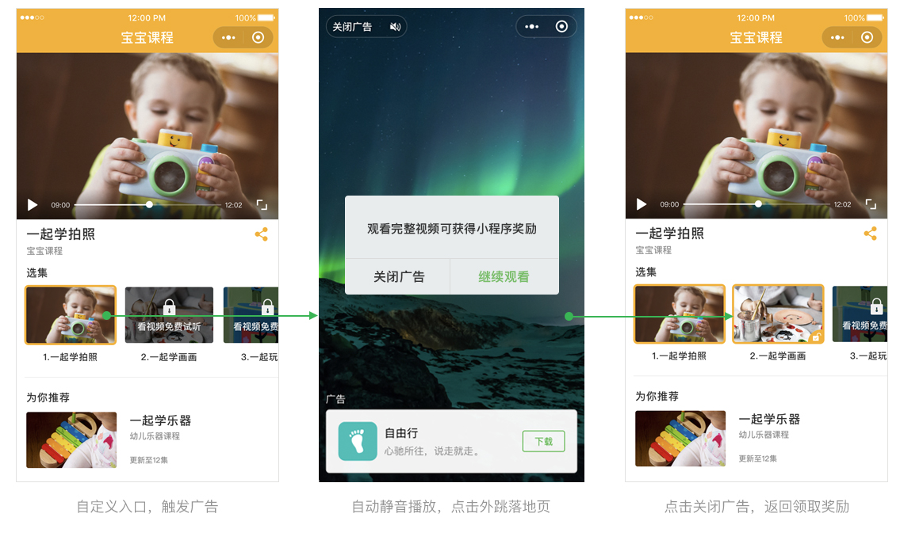
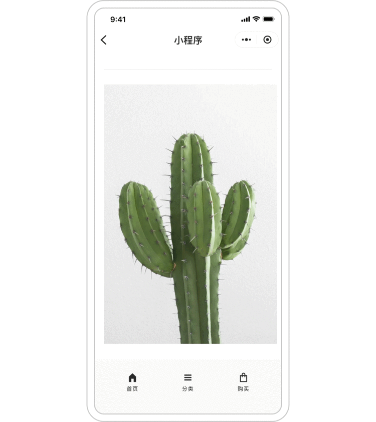

---
meta:
  - name: description
    content: 小程序广告组件能力升级
  - name: keywords
    content: 小程序,广告,变现,流量主
---

# 小程序广告组件能力升级

微信团队
2019年04月25日

激励式视频广告向非游戏类目流量主开放，开放后全类目流量主均可接入该广告能力。小程序插屏广告向非游戏类目流量主开放，小游戏类目即将启动内测。

1. 小程序激励式视频广告是指用户在小程序内主动触发的一种广告模式，用户完成广告视频观看后可获得流量主设定的相应奖励。

  激励式视频广告示例：
  

2. 小程序插屏广告指小程序在特定场景切换时以卡片方式弹出的广告形式。当用户触发流量主指定场景时，插屏广告就会自动向用户展现。

  插屏广告示例：
  

具体规则开通流程见

[《小程序激励式视频广告开通指引》](https://developers.weixin.qq.com/community/develop/doc/00060ef22cc00855a4681691c5bc01)

[《小程序插屏广告开通指引》](https://developers.weixin.qq.com/community/develop/doc/0002680c7f4960344578da0a756801)

