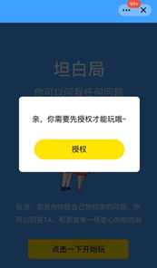
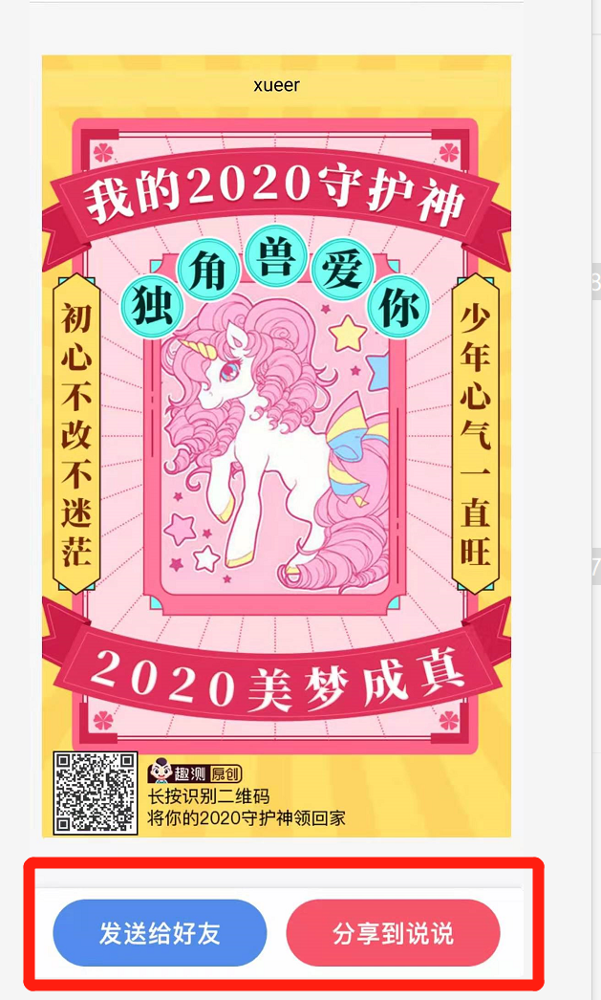
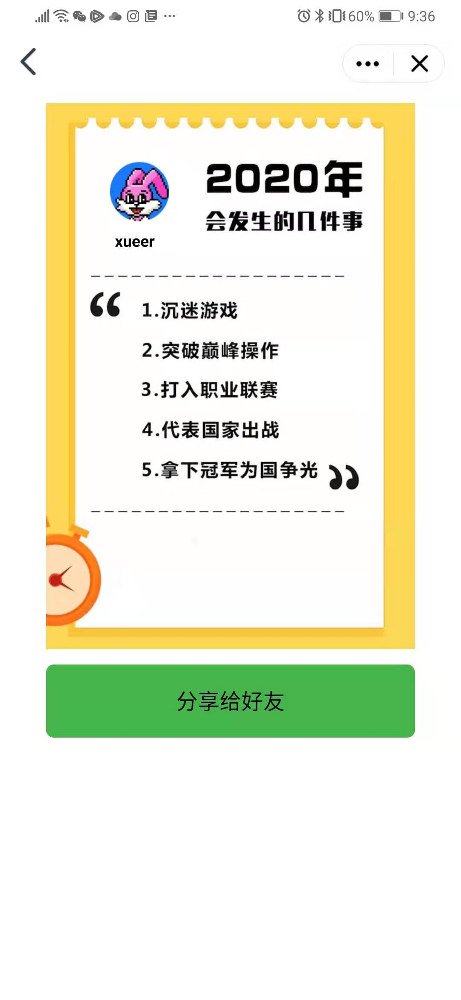
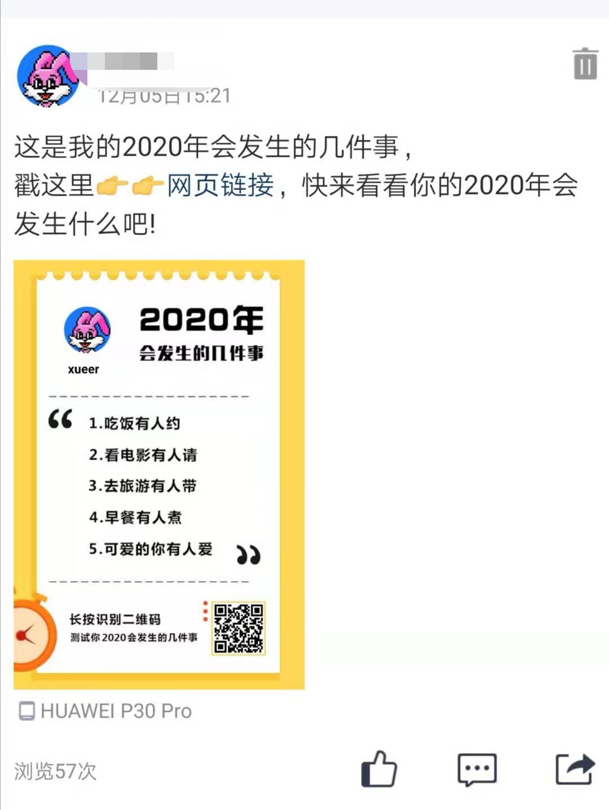
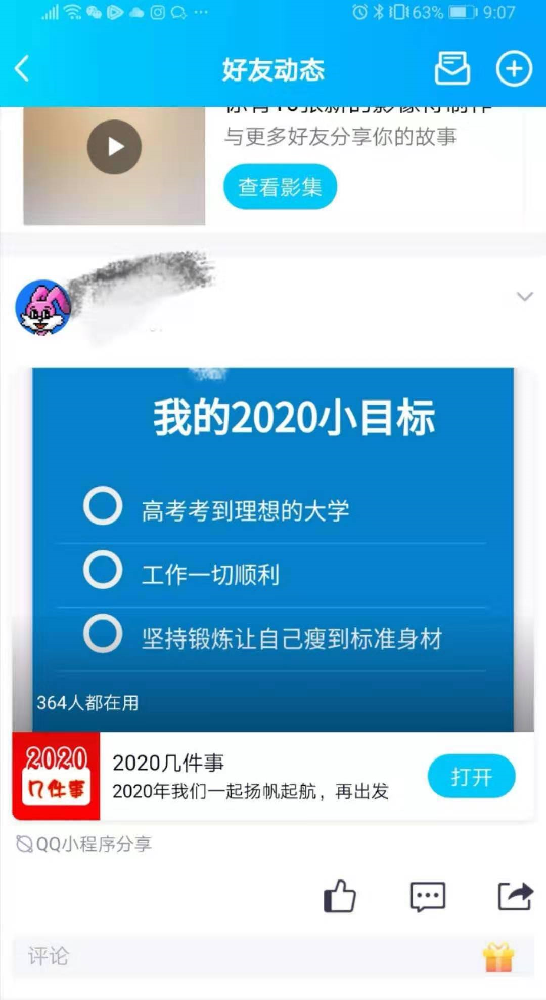
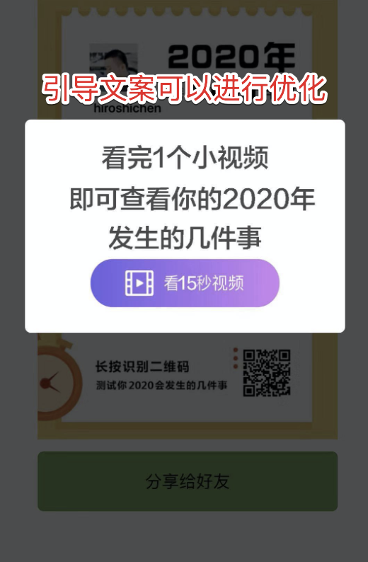
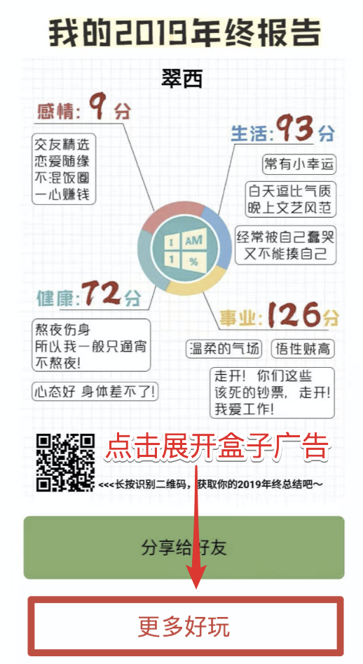
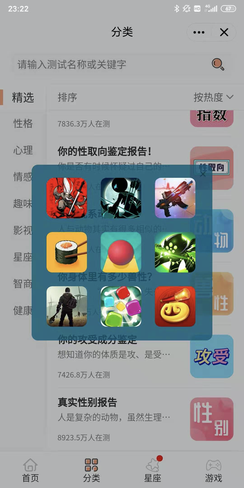

---
meta:
  - name: description
    content: 「年终盘点/总结/测试」类小程序活动运营&广告优化建议
  - name: keywords
    content: 小程序,广告,变现,流量主,运营指南
---

# 「年终盘点/总结/测试」类小程序活动运营&广告优化建议

各位小程序开发者，

年底之际，年终盘点/测试类小程序用户的参与度和传播意愿较高，特此总结该类小程序的分享优化和广告设置建议，供各位开发者参考。

## 一、运营分享建议 — 提高分享转化率

分享链路尽可能短，提高分享各链路转化率。

### 1. 获取用户授权时

优化文案，提高授权成功率

  
  

### 2. 获取结果后

通过按钮/文案引导用户分享到空间/朋友圈，降低选择成本，减少分享转化损失；

### 3. 若以图片形式分享

分享内容应做到：

- 图片尽可能清晰、突出重点，UI 设计上简洁、潮趣；

- 分享图片上带小程序码，长按识别可拉起小程序；

- 在分享默认文案中带上小程序链接，增加小程序打开转化率。

  
  

- 若以结构化卡片形式分享，则在卡片内容中呈现关键内容，吸引用户点击：

 

- 附：[QQ 小程序全链路分享指南](https://docs.qq.com/slide/DRGNLWXpPWVhEbHBM)

## 二、广告设置建议 — 提高变现效率

建议设置广告的几个环节：

### 1. 用户看「视频广告」解锁自己的分析结果

分别有两种方案参考：

1）用户必须看一段 15s 激励视频广告后，才能解锁自己的分析结果（但需注意，在引导上尽可能让用户提前知道分析的维度，再配合一些更有吸引力的文案，如：“你的爱情指数竟然是这样！”。争取提升用户的兴趣，进而提升激励视频的转化和收入）

2）先让用户免费看到基础的分析，然后再让用户看视频广告解锁进一步分析结果（需要注意：基础分析 和 看广告获得的分析 需要有较大差异，且让用户看广告前就知道这一点。用户才有动力看视频广告）

### 2. 在用户可能流失的环节提供「盒子广告」

用户看完自己的分析结果后，可以先引导分享，当用户分享完毕返回该页面后（用户可能流失的环节），可以提供「盒子广告」，给用户提供好玩的游戏盒子，既提供了用户价值，也能够带来收入

  
  

### 3. 在不影响页面体验的情况下，适当加入「banner、卡片广告」

在流量高的场景，适当加入 banner 或者卡片广告（卡片广告收益更高），如用户等待阶段、用户浏览列表阶段、分析结果的展示页等

