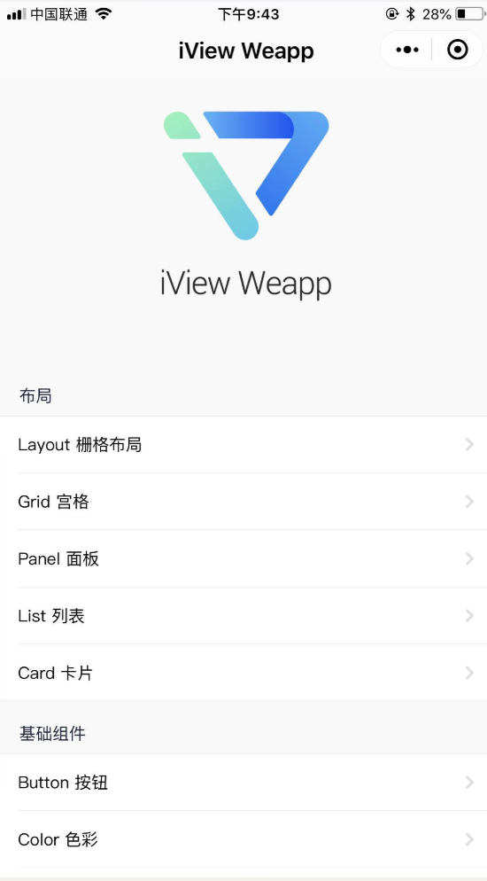
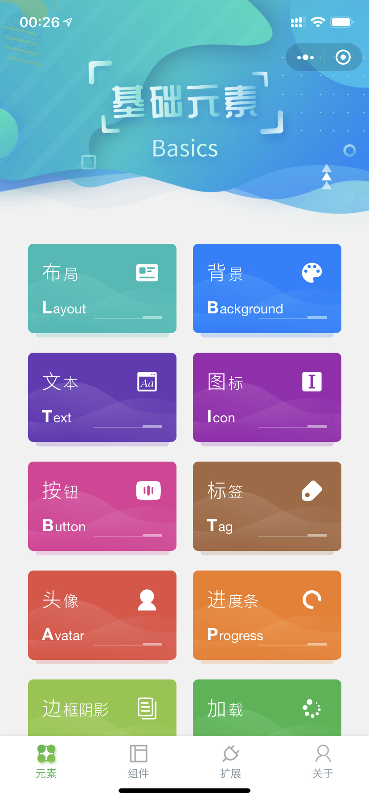
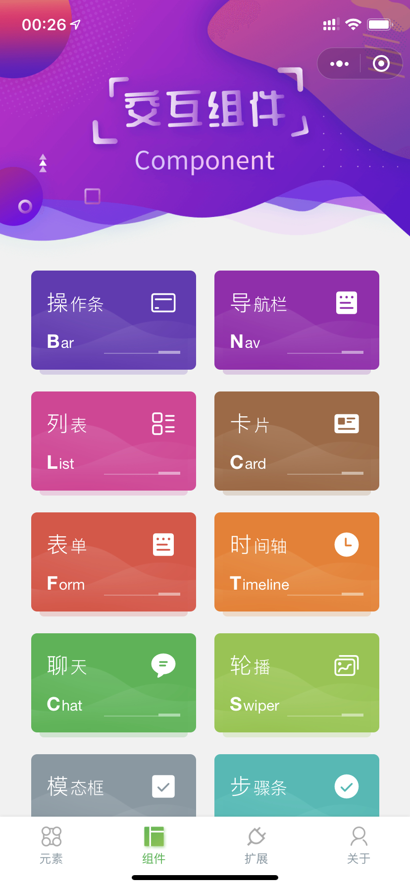
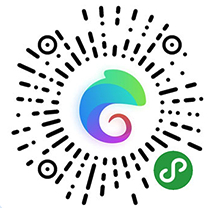
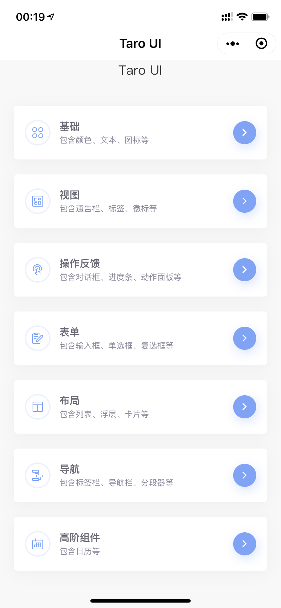
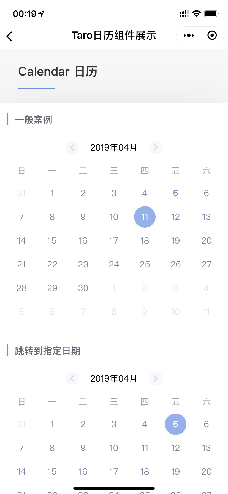

# 小程序 UI 框架对比

## [WeUI for 小程序](https://github.com/Tencent/weui-wxss)

 

项目地址：[https://github.com/Tencent/weui-wxss](https://github.com/Tencent/weui-wxss)

WeUI 是一套同微信原生视觉体验一致的基础样式库，由微信官方设计团队为微信内网页和微信小程序量身设计，令用户的使用感知更加统一。包含button、cell、dialog、 progress、 toast、article、actionsheet、icon等各式元素。

  
  

## [Vant Weapp (ZanUI-WeApp)](https://youzan.github.io/vant-weapp/#/intro)

 

项目地址：[https://github.com/youzan/vant-weapp](https://github.com/youzan/vant-weapp)

Vant Weapp 是有赞移动端组件库 Vant 的小程序版本，两者基于相同的视觉规范，提供一致的 API 接口，助力开发者快速搭建小程序应用。

  
  

## [iView Weapp](https://weapp.iviewui.com/)

项目地址：[https://github.com/TalkingData/iview-weapp](https://github.com/TalkingData/iview-weapp)

一套高质量的微信小程序 UI 组件库

  
  

## [MinUI](https://meili.github.io/min/docs/minui/)

 

项目地址：[https://github.com/meili/minui](https://github.com/meili/minui)

MinUI 是基于微信小程序自定义组件特性开发而成的一套简洁、易用、高效的组件库，适用场景广，覆盖小程序原生框架，各种小程序组件主流框架等，并且提供了专门的命令行工具

  

## [Wux Weapp](https://wux-weapp.github.io/wux-weapp-docs/#/introduce)

 

项目地址：[https://github.com/wux-weapp/wux-weapp](https://github.com/wux-weapp/wux-weapp)

Wux Weapp 是一套组件化、可复用、易扩展的微信小程序 UI 组件库。

- UI 样式可配置，拓展灵活，轻松适应不同的设计风格
- 60+ 丰富的组件，能够满足移动端开发的基本需求

  <!--  -->
  
  

## [ColorUI](https://www.color-ui.com/)

项目地址：[https://github.com/weilanwl/ColorUI](https://github.com/weilanwl/ColorUI)

鲜亮的高饱和色彩，专注视觉的小程序组件库

  
  

  

## [Taro UI](https://taro-ui.aotu.io/#/)

 

项目地址：[https://github.com/NervJS/taro-ui](https://github.com/NervJS/taro-ui)

一款基于 Taro 框架开发的多端 UI 组件库

- 基于 Taro 开发 UI 组件
- 一套组件可以在 微信小程序，支付宝小程序，百度小程序，H5 多端适配运行（ReactNative 端暂不支持）
- 提供友好的 API，可灵活的使用组件

  
  

## 参考资料

[6个最优秀的微信小程序UI组件库](https://www.jianshu.com/p/4182f4a18cb6)

[微信小程序前端框架/UI组件](https://juejin.im/post/5c0b3fcf6fb9a04a08217e0c)